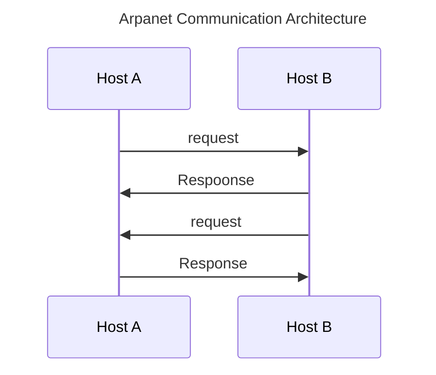
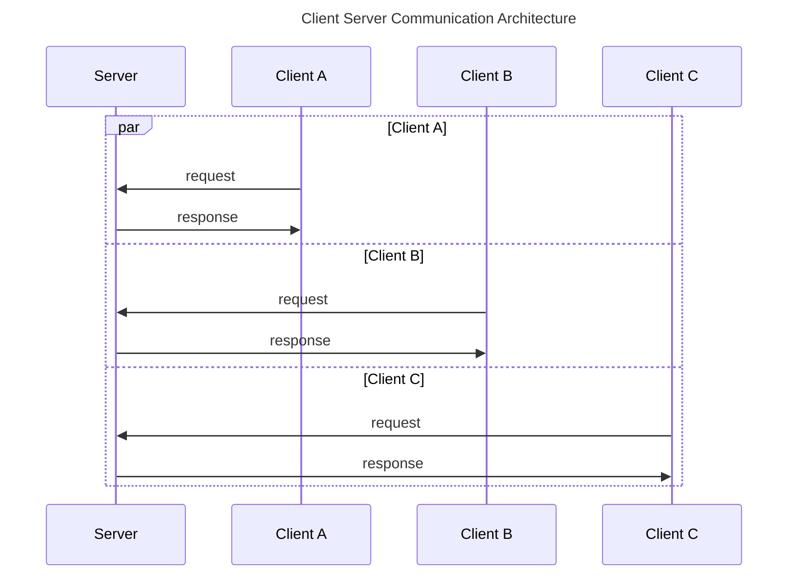
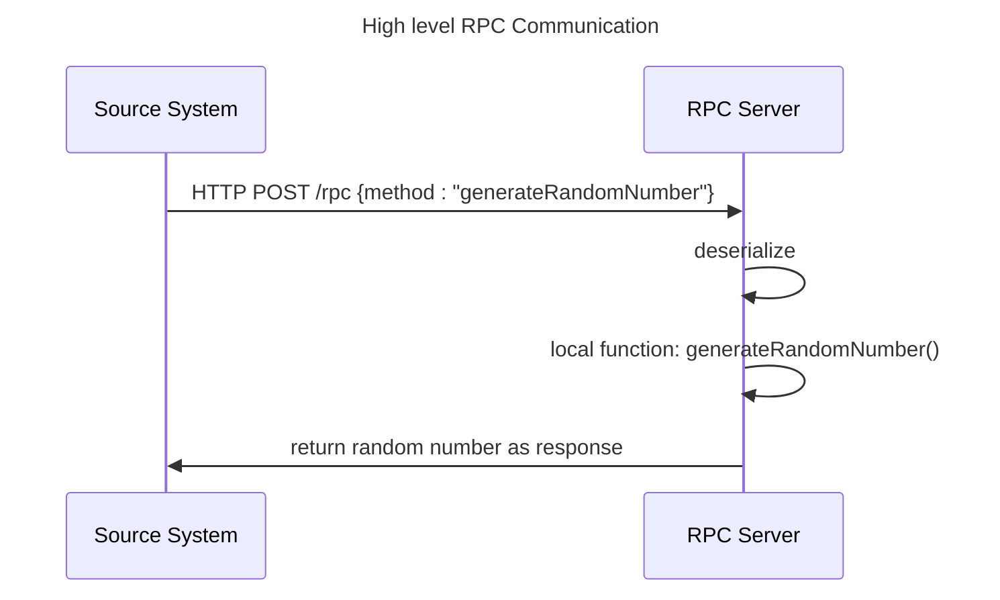
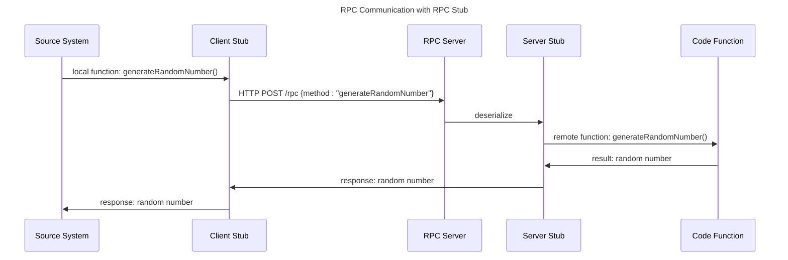
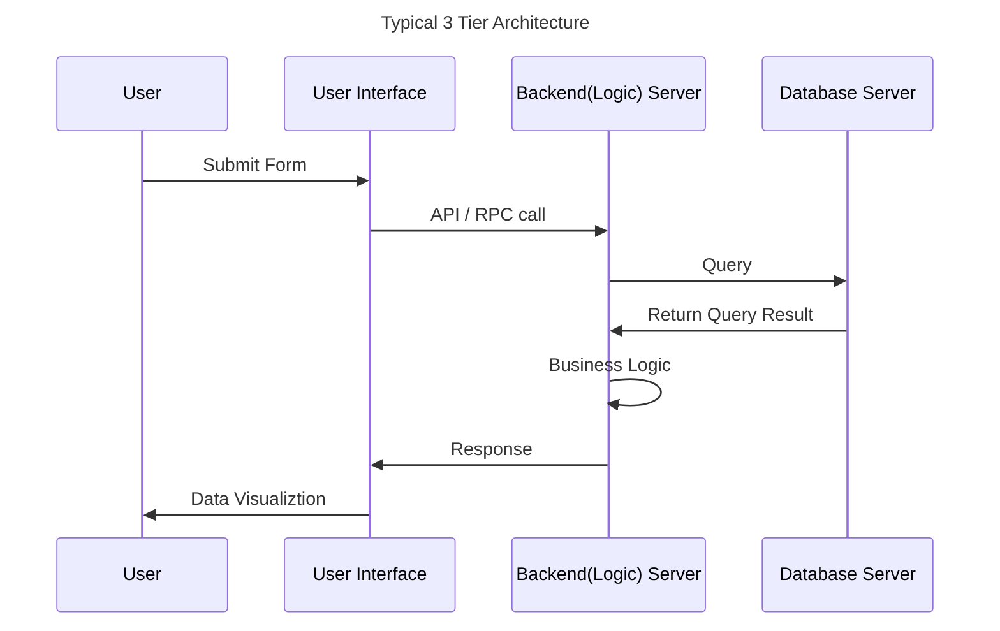
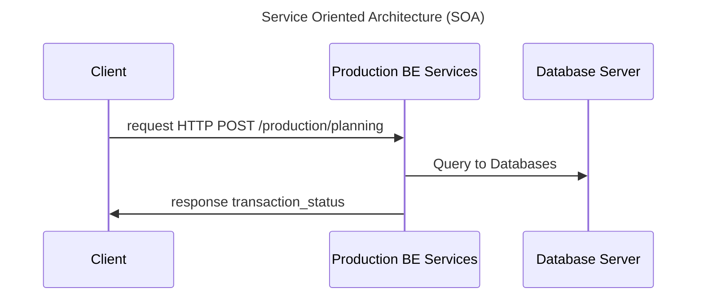
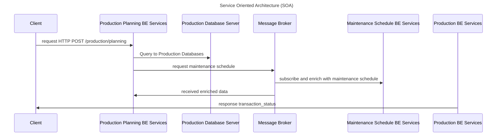

# Distributed Computing Evolution During COVID

Software engineering is evolving as well as distributed computing. Over the span of 15 years, various architecture styles and pattern are born to respond the market needs. Digital adoption is skyrocketted especially during the covid-19 period where people are sheltered at their home (can't leave to slowdown the spread of virus) and forcing them to utilize more digital application/system in the day to day basis resulting in rapidly growing market needs of digital system or application (typically a SaaS).

In responses to that situation, many organization and researchers are work hand in hand (indirectly) to come up with new system solution to accomodate the massive user bases and adapt it to the production environment.

&mdash; for example, event driven architecture (EDA)  massive adoption was occured backthen on 2019 (literally during covid).

# Timeline of Distributed Computing Evolution

Below are the complete distributed computing evolution timeline from 90s up until 2026. On every distributed computing architecture/design pattern advancement, it always **solve the specific problem** that related with distributed computing, then the solution will be refined on the next technology updates.

## 1960: First distributed computing project: Arpanet

Arpanet is the first computer network which utilize the concept of distributed computing that human ever created through packet-switching (grouping some chunk of data and send it over the network) concept and each of the grouped data or packet has routing destination information. Arpanet was created on early 60s (1960) and the **first version of TCP/IP protocol** (transmission control protocol/internet protocol) was born called as NCP (network control program) before its TCP/IP() that we know today.

### 1980: TCP vs NCP

Both of the protocl has same purpose, to send data from one computer to another computer. NCP is inferior compared TCP because it only capable to transmit data on single network where as TCP can transmit the packet over several networks. Below are the table comparison between NCP(network control protocl) and TCP(transmison control protocol)

| Parameter         | NCP (Network control protocol)                               | TCP (transmission control protocol)                        |
| ----------------- | ------------------------------------------------------------ | ---------------------------------------------------------- |
| Timeframe         | First generation of TCP                                      | Modern Protocol used on the internet ERA                   |
| Layer Separation  | Application / Transport / Internet Layers are in the same layer | Application / Transport / Internet Layers are segregated   |
| Acknowledgement   | Not Exist                                                    | Yes, Exist                                                 |
| Message Ordering  | Not Exist                                                    | Yes, guaranteed in the manner of FIFO (first in first out) |
| Connetivity Scope | Single Network                                               | Multiple Network through destinated IP (internet protocol) |

## 1980: Client Server Architecture

Arpanet is not built using client server architecture because when arpanet was created, the concept of client server architect was not exist yet at that moment.

Eventough arpanet could communicate with other machines such as printer in same network, it could not be categorised as client server due it doesnt met following rules:

1. no fixed role: any machines on arpanet can communicate with the others means every machine is a server and a client.
2. because every machine or host act as both server and client, any machine can send data to another host and receive data from another host.

Unlike arpanet, client server architecture enforeces following rule of thumb:

1. Eech system on the machine should have a single role in particular journey. For example: even a machine has web server and web client, the specific system must only has one role. web server as server and web client such as web browser is the client.
2. In different journey such as integration with surroundings server, the web server can act as a client. But there is always a clear distinction wether a system is playing client role or server role during particular journey/use cases.
3. Server must be available 24/7. 
4. **Client is request driven**. A request should be made before server can send data to the client. In the newer architecture style/pattern, server can freely send a data/response even the client dosnt request it. Such pattern called as push based architecture. Client will response a callback endpoint and server will send whatever data there.
5. Typically has one to many relationship between server and clinet. One server could serve several clients at once.
6. Centralized authority. Unlike decentralized architecture with as peer to peer pattern where all machines within same network can communicate without central control. Example of peer to peer application is torrent and bitcoins

## 1981: Remote Procedure Call (RPC)

Remote procedure call is a method of calling a surrounding system function as it were a local function execution.

For example, a function to generate random number between 0 and 10 is exposed using RPC

both of REST API and RPC execution are done through http based protocol. However, a RPC communication has a concept called as **stub**. Its not "stub" in context of inject local content to function/variable/class for unit testing purposes. Stub in the context of RPC is a middleware or proxy that brindges between remote function which run at RPC server and local function which stay at the client.

below is the adjusted RPC communication execution using actual stub proxy/middleware.

rule of thumbs:

1. both client and server has RPC stub
2. client RPC stub call the remote function to server RPC stub through the RPC server.
3. server RPC stub will call local function inside the RPC server
4. response will be sent all the way client through RPC client stub from server RPC stub adn RPC server

## 1990s: N tier or multi tier architecture

N tier architecture is a concept of segregating system into **three different application layer** including : UI **layer (frontend)**, **logical layer (backend)** and **database layer**. Each of the layer will only act based on their assigned roles. For example: client should not compute any transaction, its only responsible is to display or visualize data from server and to take input from user and send it to the server's API.

	Note that before N tier architecture concept was invented, all of system was adopting monolithic architecture where there is no segregation between presentation, database and logic.

Similarly, database layer should only manage the system database eventhough the business logic can also be applied on this layer at database level. It should not expose any API to the frontend.

## 1990s: Service oriented architecture (SOA)

In the same decades (90s), along side with n tier architecture, scientist also introducing new architecture concept called as SOA (service oriented architecture). SOA focus on splitting logical **business function** services into smaller chunks and has central orchestrator.

For example, a manufacturing organization has three different core business department including: engineering, production and maintenance. Each of the departments has different business function. For example, production department has planner function and scheduler function. Each of the functions will be represented as one services on the system.

Below are the sample SOA business representation on a IT system

| Department  | Function              | Backend Services        |
| ----------- | --------------------- | ----------------------- |
| production  | Planning              | /production/planning    |
| production  | Scheduling            | /production/scheduling  |
| production  | Monitoring            | /production/monitoring  |
| maintenance | Work Order Management | /maintenance/workorder  |
| maintenance | scheduling            | /maintenance/scheduling |

each of the business services can be accessible by any system that require such information. For example, a maintenance system require production schedule to align their maintenace schedule. Those data can be retrived by calling specific backend services.

Here are the ke rule of thumb of services oriented architecture

1. Each services focus on specific task
2. Reuseable across all systems (not limited to that domain only)
3. Can be accessed remotely
4. SOA has central orchestrator.

note: usually the services is represented using business language so that both of IT and operations personnel can understand and speak in same languages.

&mdash; SOA is often furtherly refined with microservices architecture (adopting the infrastructure concept of microservices) or 3-tier architecture or even monolithic because SOA is reside on the logical side of the backend system, not in infrastructure level.

## 2010s: Microservices Architecture

Most of medium to big SaaS (software as a services) which look for scalability are adopting microservices architecture due to the massive user bases while b2b back office application with small to minimum transaction throughput are still sticking with three tier or even monolithic architecture especially on legacy apps.

	Microservices is SOA on steroid

Below are the rule of thumb of microservices architecture

1. Both SOA and Microservices are segregating the services based on **business function**
2. Microsevices can go even deeper granularity, instead of per business function, it could go per business function process. For example: SOA (**production** services), microservices (**production scheduling** microservices)
3. SOA doesnt govern about dataownership, while microservices architecture has data ownership rules: a microservices can only access specific database and table. For example, production schedule microservices only access production database and production schedule table only. It should not perform join query directly on database level to maintain the **independently**.
4. Microservices govern about the infrastructure process. For example: each microservices must be able to be deployed on its own (should not be dependent on other services). if one services down, its should not affect other services.
5. Microservices is centralized approach and often paired with event driven architecture(pub-sub), while SOA is has one central brain who coordinates all of the services through ESB/orchestrator layer.

In short, SOA is segregated services per business unit with centralized orchestrator while microservices is decentralized and decoupled business function process services without central orchestrator. Thats why most of legacy system on enterprise organization still adopting SOA and new or modern applicatins are adopting microservices/event driven. Orchestration on microservices is still required, however its covering specific **domain/bounded context** integration where as SOA orchestrator is aligning the whole services.

note: its not recommended to implement microservices on small throughput system as it will be overcomplicated everything. More effort with less value gained (because it will only benefit system that require high scalability/throughput)