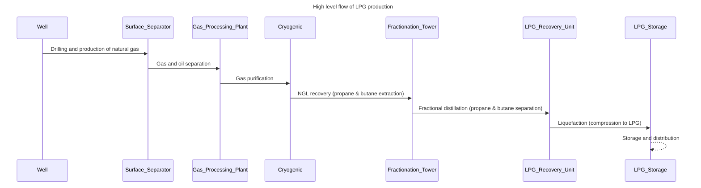

# What is Swimlane diagram

Swimlane diagram has at least **more than one entity divider** and **each of entity has its own process flow**, thus, the swimlane diagram is good to show is good to represent process sequences for the readers as it combine one or more flowchart from different point of view (POV). 

## Sample of process sequence for processing natural gas into consumer LPG

For example, below are the end to end high level engineering & digital process of natural gas is processing into consumer ready LPG for cooking.

| Process                                                      | Facilities           |
| ------------------------------------------------------------ | -------------------- |
| Drilling and production of natural gas - Surface/sub surface drilling to retrieve natural gas from the mother earth | Wells                |
| Gas and oil separation. Oil will be sent to oil refinery and gas will be processed further | Surface Separator    |
| Gas purification by sweetening and dehyrating the gas - To completely remove water, hydrogen sulfide and carbon dioxide | Gas Processing plant |
| natural gas liquid recovery - extract propane and butane     | Cryogenic            |
| Fractional Distilation - divide and separate hydrocarbon which can resulting in petroleum gas at 20 degrees celcius. Propane and butane are separated. | Fractionation tower  |
| Liquefaction - Convert petroleum gas into liquid petroleum gas | LPG recovery unit    |
| Store the LPG into gas tube - ready for end consumer usage.  | LPG storage          |

## Converting process sequence into swimlane diagram

There are at least four steps to convert and visualize process sequence into swimlane diagram

1. Understand the objectives & the audiences 
2. Identify the actor/entity/system
3. Identify the sequences
4. Draw the Diagram

## 1.Objectives

The objective of the diagram is to show **high level LPG production process** for commoner (non oil and gas engineer).

## 2.Identify the entity

production process on any manufacturing plant or oil and gas plant will be separated **based on the facilities**. In this case, the raw material or gas will be flown from well then to gas processing plant until it become ready to consume liquid petroleum gas (LPG) on cyclinder tube.

### 3.Identify the sequences

Below are the enriched table of LPG production high level flow with process sequences.

| No   | Facilities           | Process                                | Dependency |
| ---- | -------------------- | -------------------------------------- | ---------- |
| 1    | Well                 | Drilling and production of natural gas | n/a        |
| 2    | Surface Separator    | Gas and oil separation                 | 1          |
| 3    | Gas Processing plant | Gas purification                       | 2          |
| 4    | Cryogenic            | Natural Gas Liquids recovery           | 3          |
| 5    | Fractionation tower  | Fractional distillation                | 4          |
| 6    | LPG recovery unit    | Liquefaction                           | 5          |
| 7    | LPG storage          | Storage and distribution               | 6          |

### 4.Draw the diagram

Swimlane diagram will be drawn based on the identified process sequences above. Each facilities will be the "lane" or column and each process will be interconneted depending on the facilities and processing order.

