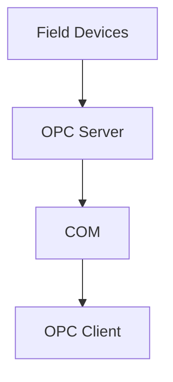
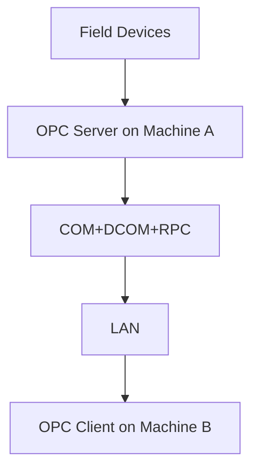
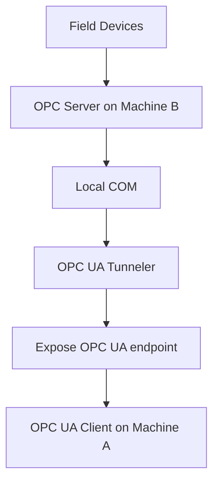

# The Relationship between SCADA and OPC DA

Supervisory control and data acquisition or also known as **SCADA** is a system which consisted of hardwares and softwares to monitor, control and collect data from sensors and actuators. Scada is the bridge between field devices (L0 on the ISA95, for example: temperature sensors, valve control actuators, etc) , PLC (programmable logic controller), RTU (remote terminal unit) or HMI and operators.

	In short, SCADA is the brain for data capture, data logging/store and data visualization (in form of alarm or trends in HMI)

Some scada manufacturers like mitsubishi combine both SCADA and HMI (human machine interfaces) that can directly collect, store (short term) and monitor data from field devices or PLC through modbus protocol and compute the conditions based monitoring (CBM) then trigger an alarm or action.

Once the field devices data and alarm (SCADA generated) is captured, it will be stored on the **SCADA local historian**. Those **data can be shared with other OT system and IT system through OPC DA (data access) protocol**.

## Why OPC DA still being used in 2026?

Object linking and embedded for process controll and digital access or also known as OPC DA is legacy communication protocol standard that used in the industrial automation. Mainly used to connect control devices such as PLC (programming logic controller), DCS (distributed control system) or actuators into supervisory layer like SCADA, HMI or ICSS.

The reason that OPC DA still used even in 2026 is because majority of industrial facilities (especially the one that has been around for more than one decades) are built using legacy OT system standard in which OPC DA is the standard communication protocol.

OPC DA is can be used for **both data acquisition and controlling** actuators or PLC (for example: control the temperature, control pressure, open/close valve or adjusting the process flow towards the PLC microcontroller) causing major security concerns. Ideally the read and write protocols should be separated to reduce the potential security risk introduced by data acquisition system as its often exposed towards IT network or broader network (lets say internet).

OPC DA is not custom network protocol like modbus TCP or MQTT or HTTP, but instead its communication method that was built on top of microsoft windows interfaces called DCOM (distributed component object model). DCOM allow data sharing across multiple computers as long as its use same operating system (windows that support DCOM).

Before DCOM was introduced, the earlier version of windows interface for data/object sharing is called as COM (component object mdoel) which can only be used over two different program within same windows instances (local pc). Then it evolved into DCOM which can send the object into multiple computer across the network through LAN (local area network) connectivity and RPC (remote procedure call) program function.

## Data flow of OPC DA

OPC DA can support both local and distributed communication via LAN. local OPC DA communication within one windows OS

In OPC DA ecosystem, there are four organism (system) that live in it including OPC DA client, OPC DA server, field devices and supervisor system (SCADA). Each of them has same objective but different function inside that ecosystem. Field devices is the main subject on the ecosystem. Hence, the objective of the ecosystem is to **control and acquire data from the field devices through controller (PLC) **. 

Field devices can be any sensor & actuator from different brand. They use different communication protocol (S7, EtherNet/IP, Modbus and so on). OPC server is the polyglot speaker(can understand many field devices communication protocol from various brand) and has responsibilities to translate those protocols into **one standardized communication protocol which is OPC DA** using **distributed component object model** as the **payload format**.

OPC client is the bridge or middleware which **allow supervisory system like SCADA to "talk" with the field devices eventhough SCADA didnt speak the sensors/actuators/PLC languages**. "Talk" means the scada is capable for **asking** the sensor readings or even **commanding** the field devices to change their operating parameter like temperature, volume, flow and so on (depending on the field devices feature/capability).

Below are the responsibilities segregation between OPC Server vs OPC Client which use **client-server concept instead of pub-sub**

| Domain      | OPC DA Server                                                | OPC DA Client                            |
| ----------- | ------------------------------------------------------------ | ---------------------------------------- |
| Role        | Data Provider & OT Protocol Translator                       | Data Consumer & Command Giver            |
| Behavior    | Active-Standby, waiting for client request.                  | Initiate connection to the OPC DA server |
| Application | Kepware, matrikon, mitsubishi ignition,  PLC embedded server, HMI embedded server | SCADA, historian, edge gateway (rare)    |

Once OPC server is connected and able to communicate with field devices, it will expose address space / namespace just like in OPC UA server. The address spaces is browseable folder tree. OPC DA client then can browser the objects inside the address space folder tree.

	sensor hierarchy readings which formatted using binary number will be converted into human readable tags hierarchy format (001 -> plant1.machine.temperature).

Not only the hierarchy, but the sensor value readings (eg: temperature, pressure, flow-direction, vibration, etc) will be stored  on the opc DA server memory as a cache (**not persisted**).

## Distributed Component Objected Model over the Network

OPC DA can't also travel through local network with the help of RPC and LAN cable using following schema

Both of the OPC server and OPC client will still have same domain responsibility segregation, however, the object data transmission is now flowing through local area network (LAN) and remote procedure call. Machine A will be connected with machine B using ethernet cable and linked via industrial switch.

Below are the step by step on how distributed COM (DCOM) works.

1. OPC client on machine A intiate a COM request (eg: read(presssure)) **locally**. In this case, asking for the latest pressure readings from the PLC and sensors.
2. Then, the pre-configured DCOM middleware called as MS-DCOM, will "route" the request to specific OPC DA server and bundled in into binary packet.
3. Windows will use microsoft RPC to transport the package over the network using TCP/IP
4. machine B (OPC DA server) has DCOM listener and will receive the package and unpack the binary packet back to the COM.

## The Needs of OPC DA Conversion In Modern ITOT Architecture Landscape

OPC DA has biggest downside in terms of computer networking and cyber security due to **the inability of transverse through firewall** because COM is windows interfaces not a protocl, hence eventhough DCOM can integrated over to another machine within same network via RPC+TCP/IP, it still can't pass through firewall. Apart from that, OPC DA is vendor locked because its ran on top of microsoft windows. Some systems within OT ecosystem like SCADA, historian or even MOM/MES are running on non-windows system (eg: linux) which unable ot use OPC DA client resulting inability to communicate with OPC DA server.

	Such condition cause computer scintist create system called OPC UA tunneler solve the problem

Before deep diving into OPC UA tunneler, lets understand first why OPC DA can't pass through firewall eventhough COM is turned into binary packet and sent over TCP/IP. For example when OPC DA client connected with OPC DA server and asking for latest temperature readings, the request packet went through port 135 (DCOM service control manager). then the DCOM will route the request and **assign it into random port** ranging rom 1024 to 65535 which causing issues on the firewall as we have to open alot of ports and introduce unnecesary security risks.

OPC UA tunneler will solve this issue by converting network DCOM which previously route the request into random port into **two fixed COM calls** which also compress & encrypt the network DCOM packet and connect it into **single TCP links on specific fixed port** so that only one port is opened at firewall and not introduce any security risk.

## OPC DA to UA tunneler Data Flow

Aside from tunneling OPC DA network DCOM so that it can pass through firewall, modern OPC tunneler like matrikon can also wrap the DA protocol into more system-to-system standard protocol like **OPC UA**.

below is the data flow if OPC DA and OPC UA tunneler are residing on same server

Suppose machine B is residing on L2 and running OPC DA server. It connected with local PLCs. means the OPC DA can access sensor readings and send command to the PLC. Then on the same machine, an OPC UA tunneler is installed. Is has built in OPC DA client to access the PLC via OPC DA server through local DCOM. Then the OPC tunneler that has been connected with the OPC DA server will expose an OPC UA server in which all the sensors readings (often called as tags) can be accessible for OPC UA client that reside on machine A.