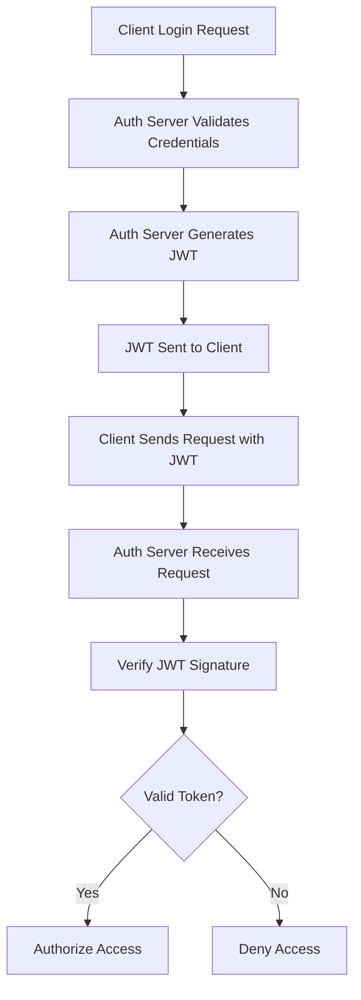

# Claim in context of Authorization Management on Software Engineering

Claims is a statement made by person or an organization which commonly used for administrative task. For example, before a plane passanger can retrieve their luggage on the baggage's conveyor belt they have to show **baggage claims** first to the airport officer. Bagage claims contains passanger information including boarding pass, identification document (personal id) which can be used a proof for the baggage ownership. Hence, claims on the context of baggage claims is statement of **baggae ownership.**

In the context of authorization management on software engineering, JWT (JSON Web Token) is a claim statement of a **user identity ownership** which is granted to the user when they able to **proof their identity through authentication method** such as login using username & password, OTP or SSO.

## Inside the Json Web Token

JWT is a standard format to store and transfer user claims during the authorization process **safely**. To ensure maximum level of security, JWT can be signed using HMAC based key secret or through RSA/ECDSA based private/public key. 

By default, JWT is encoded using base64 url encoding. Before the JWT is encoded, generally there two data inside the token:

1. userId - system identifier for particular userId
2. role - assigned roles for that specific userId
3. permissions (optional)

those data is formatted using JSON (JSON web object).

```json
{
"userId" : "4dece1e4-97f8-4fdc-8c13-6b0ffb2d1e7e",
"roleId" : "6d181683-69f9-4cf7-97fb-74625e2085d1"
}
```

There is a scenario where **user permission is also included inside the JWT** because its used for authorize the request to specific endpoint on at **API gateway/management level**. Such practices is common because API gateway/management doenst have capability to make an API call or database request to retrieve user permission from the databases.

## How to protect JWT from tapering?

JWT contains sensitive information regarding the user access. If the content of the token can be tampered (overrided), the attacker can easily change their token into other member/user token. 

To prevent such attack scheme, the JWT signing process is absolutely required. The signature is generated from following combination

	header + payload + secret 

or if using private key

	header + payload + private key

if the JWT content is modified, the signature become invalid. Thats why JWT is becoming the standard of user claims (in the context of authorization management)

# Authentication & Authorization Flow using JWT



Below is the step by step process of implementing JWT (JSON web token) for authentication and authorization process

Note that authentication ("who is the user", "why the system should allow the user in?") is needed before authorization ("what can the user do") can be executed.

## JWT Based Authentication Using Email and Password

Authentication steps with JWT

1. User input email and password
2. Validate the credentials (does the email and password match)
3. Get assigned roles and permission based on the associated userId
4. Generate JWT Payload
5. Sign JWT

## JWT Based Authorization

Authorization steps with JWT

note: on this scenario, user is trying to access GET /milestone HTTP REST Endpoint

1. User request GET /milestone by attaching the JWT token/authorization bearer token on the request header
2. milestone services extract the token
3. verify the signature (to prevent JWT tempering attempt)
4. validate the claims - check if the token still valid (not expired)
5. check permission
6. send http response along side with the milestone data

Refresh token can be provided to prevent user from being logged out & required to logged in again. Those token must be persisted on the storage (eg: on the databases) to enable the "remember me feature". Once user click logout, the refresh token need to be deleted. The refresh will be persisted on the client side as well by using **cookie**

