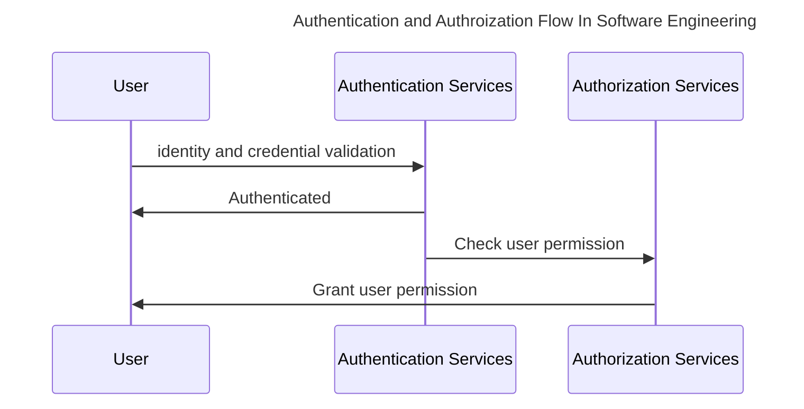

# The Analogy of Authentication and Authorization Based on Authority Concept in Book Publishing Industry

Both authentication and authorization are derrived from "author" word  which mean person who write a book, article or  any writings. As the creator of the writings, a **legitimate** author can publish and sell the books to public audiences. If someone tried to publish and sell the same book/writings, lawsuit can be filled against those poeople. Infact, all most every country enforce copyright law.

Random person can't just self-proclaimed as the author of any books. Each published book has an official publisher name and officialy registered on the country legitimate department who responsible to govern copyright.

The same "authority concept" is used on software engineering. Authorization process focus on **granting the user rights** such as adding new item, reading particular data/information or even delete a data.

In other hand,  Authentication focus on **identifying the user registration** by checking against two primary criteria: user registration at databases and the authentication result. If one of those two criteria is not passed, means that particular user **can't be authenticated**.

Authorization is done once the user is **authenticated** a.k.a when the system recognized that the user is **registered on the system** and **perform legit authentication method** such as entering username and password, login using gmail and so on.

## Key Differences of Authentication and Auhtorization

Below are the key differences between authentication and authorization in Software Engineering

| Aspects         | Authentication                                               | Authorization                                                |
| --------------- | ------------------------------------------------------------ | ------------------------------------------------------------ |
| Focus           | Verify user identity   "**Who** Are you?"               | Grant user permission   "**What** you can you do?"      |
| Primary Process | Check whether user is registered and ask the user to perform **login**. | Grant the authenticated user permission to perform activities within the system. |
| Sequences       | First                                                        | Second, can only be done once the user is authenticated.     |
| System Object   | Authentication Method: username & password, OTP, Face recognition | Role & permission                                            |
| Output          | Login Status                                                 | Permission List                                              |

Both authentication and authorization are enforcing security towards the platform user to ensure no authorizated and authenticated person can access the platform.

# Main Archetypes of Authentication Method

Below are the list of authentication method that commonly used in software engineering

1. **Password-based**: Old school authentication method, user need to input their username (or email) and password that they used when registering on that application.
2. **Oauth 2.0**: Login using trusted third party credentials such as google mail, facebook or github. Very popular nowdays due to the simplicity as the user doesnt need to fillout manual form for registration. Increasing the likelyhood of sales conversion.
3. **OTP (One time password)**: User will be sent 4 until 6 digit codes to their phone number or email. Second most popular as it give the **fastest onboarding method**.
4. **Multi Factor Authentication(MFA)**: Combining password-based or Oauth with OTP. The most secure authentication method. Commonly used in high risk industry such as banking or any SaaS which has payment process.

# Main Archetypes of Authorization Method

Authorization method is a way to **logically represent the user permission within the system**. It often to be structured using following pattern:

1. RBAC (role based access control): the most common pattern, each user will be assigned to one or multiple role and the permission will be attached to each role. 
2. ABAC (Attribute based access control): Instead of using role, system will use one of the user attribute (for example: user assigned department) to grant the permission. Commonly used by back office apps for goverment
3. PBAC (platform based access control): Multi factorial permission assignment. If RBAC only evaluate the user role, PBAC will evaluate more than one factor. For example: role, deviceNumber, IP address location and access time. Commonly used in cloud platform as it manage the whole IT infrastructure.