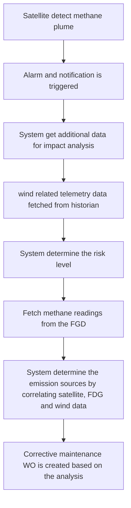

# Two Types of Methane Tracing

Methane compounds is invicible to human eyes. It require specialized tools to detect and trace  the methane leak or methane plume. Leak detection is focused on **identifying the leakage sources** while methane plume detection is to **determine the trajectory of leakge** (horizontally and vertically). They require different sets of methodology and tools.

## Methane Leak Detection

Main objective of methane leak detection is to identify the **emission sources**. Methane can escape from following equipments:

1. valve - common sources of methane leak. valve is an equipment which regulate the flow of fluids. Valve can be opened and closed using a component called as **stem** that sealed by packing material. If the seal is wears out, shrink, loosen, damaged it could cause methane leak from the pipeline throught the valve & stem.
2. flanges - bolted connection between two pipe sections. if the bolt is loosen or the gasket is aged/wears out/damaged, methane could be leaked to the air. Small gap on the flanges can leak methane into the air.
3. compressor - equipment or mechanical devices that can increase the pressure of gas by reducing the volume. Compressor is the heart of refinery facilities as it responsible for the gas refining process. Compressor also has seals arround the rotating shaft (mechanical component that transmit power from motor or engine to the piston). If seal is loosen/damaged/wear out it could leak methane gas.
4. vents - equipment to **release gas intentionally**. methane could get leaked during startup, shutdown, pressure control operations or maintenance. However, venting is not considered as fugitive leak because its an intentional release of methane gas.
5. pipeline - structural integrity degradation which lead into corrosion/metal losses can leak methane gas to the air. Apart from that, any mechanical damage, joint leakgage or even small crack on the pipeline can also leak methane gas to the air.
6. Tanks - If the tanks temperature is heated enough, it could increase the internal pressure inside the tanks which allow methane gas escape through the pressure or vacuum vents.

Despite the variance of emission sources, all leakage occurance has same causes which is the **result of pressure difference** between equipment and the surroundings atmosphere. If equipment has higher pressure than the atmosphere surroundings combined with seal failure or any openings it could release methane to the air(flow out).

There are four method that can be used to detect methane gas leakage from these five equipment/assets such as: handheld methane detector, optical gas imaging camera, methane sensor arround the equipment and LDAR (leak detection and repair) inspection

## Methane Plume Detection

Both methane plume and methane gas are invicible from human eyes. Methane gas is detected near the equipment which can cause methane leakage such as vent, compressor, valvae and so on. However, methane plume (cloud trail that contain methane gas) can only be observed and detected on the atmosphere once the **methane is released**.

There are five common method to detect plume:

1. Satellite observations
2. Aircrat surverys
3. Drone mapping
4. Laser system
5. Atmospheric sensors.

All of these method can collect following parameters: plume size, plume direction, plume concentration, and emission rate estimation.

## The Relationship Between Methane Leak and Methane Plume

	Methane gas leak from the equipment -> methane released to the air -> methane plume is formed

Satellite capture methane plume every x minutes by checking the specific wavelength on the light spectrum. If methane plume is detected, then investigators will further check the wind data to estimate the methane gas spread area or coverage. Using both wind and satellite data, investigator can determine the degree of "destruction" or **risk level**

Once the methane plume is formed, there is nothing to be done. the risk can only be accepted at that cases as the event (methane plume) already occured. However, a preventive action can be executed by pin pointing the methane emissions sources. This is where the methane leakge detection method will be used by the usage of sensors near the equipment.

Once the culprit is detected, then **corrective maintenance** need to be performed. For example, if the methane gas leakage is caused by valve's stem seal worn out then the seal need to be replaced with new seal.

below is the typical digital thread of methane gas detection analytics using three main data sources (fire gas detector, satellite imaging and wind data/meteorogical instrument).

Top-down approach (plume detection then methane gas leakge detection).

Note: following workflow is reactive. It should only be used for investigation purposes and build the knowledge model for methane leak usecases. Operations and mainteannce team must have separate preventive flow.

below are the typical telemetry or tags needed from each sources to perform comperhensive investigation.

| No   | Sources                               | Data                                                         |
| ---- | ------------------------------------- | ------------------------------------------------------------ |
| 1    | Satellite                             | Detection timestamp, latitude, longitude Methane concentration or intensity (PPM or PPB) Plume footprint/polygon Estimated emission rate (kg/hr or t/hr) |
| 2    | Fire Gas Detector: Methane readings   | Timestamp, Methane concentration Lower explosive limit  |
| 3    | Anemometer / Meteorogoical instrument | Timestmap, wind speed, wind direction Humidity, Atmospheric pressure & gust speed |