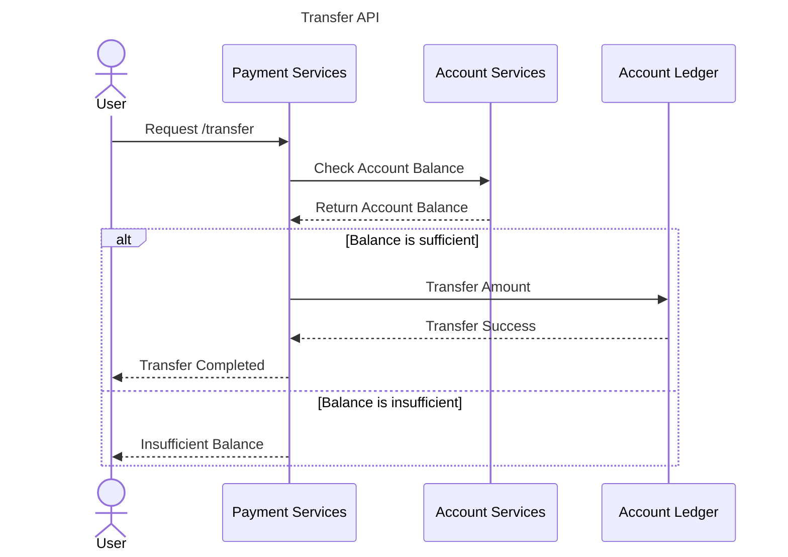

[Hello world!](/assets/images/2025-05/helloworld1.jpg){: .center-image }


# The Importance of Writings Hello World as Developer

Coding is just like other engineering activities which require deep technical knowledge and analysis. Before software source code can be written, the system design need to be defined including functional requirement, infrastructure design, database structure and application architecture. In order to make small workable code  software engineer tend to breakdown complex source code into smaller pieces in order to make it readable, reuseable and workable by other software engineer in same team.

Without breaking down source code into smaller and modular pieces per business or technical domain, team collaboration can't be initiated. Imagine writing a platform as a servies like facebook where it has super complex business process in single file, it would be really hard to manage and scale the team properly.

The habits on always make small workeable pieces cause the born of "hello world" program where software engineer write a simple pieces of code as follows

```javascript
console.log("hello world")
```

Lets a take a look on real examples of transfer API on backend system of banking applications.



Payment services act as the transactions orchestrator who coordinate the transaction between Account services and Account Ledger. On above diagram, it has arround seven transaction process but in reality it may be hundreds. Each transactino has their own business process and business rule. The code need to follow banking polices and processes.

But then, following question will be come to mind

	When software engineer can actually start to write the business rules and business process on the code?

the answer is: if only if the **code segment can be executed**. On integration scenario like above sequences diagram, business rule can only be written once the **handshake between each services can be made**. This is where writing "hello world, i can already connect to account services" is critical steps to ensure account services API and account ledger API are reachable **from the orchestrator service's code** (payment services).

Looks funny, whats the point of writing "hello world"? infact, if those code can run and the "hello world" word actually get printed on the console, means the program logic is working perfectly. Eventhough IDE debugger breakpoint is getting better to run the program until specific line, "hello world" testing is still being favorited by software engineer because its simplicity.

Apart from testing, a successfull execution of "hello world" printing on some specific segment on the code will give **mental ease** and feel good sensation due to the brain releasing dopamine (a hormone that released once human make an achievement) to the software engineer as it give assurance that their program is running properly even only at that small section of the code.

## The Application Hello World

"Hello world" can be printed anywhere at just like breakpoint pointer on a debugger. Below are the some critical code segment that might be worth to be checked using "hello world"

1. **If Else Statments**: Before writing any business logics that belong to each condition statement, "hello world" can be used as a pointer if the condition are met so that developer can focus first on evaluating the condition logics before applying the business logics/rule.
2. **Connection Initialization**: whether it is database initialization or some port listener initialization, both need a checking steps whether the initializatrion is success. "Hello world" fit for such test scenario.
3. **Nested Loop**: Nested loop can be nightmare. But with help of "hello world", the loop orchestration inside the nest can be manageable. Note: netsed loop itself need to be avoided.

## Hello World can release stress

"Hello world" can release huge stress from the developer mental if combined properly with proper coding principles. For example, writing small pieces of code then check it with "hello world" is much better than directly wrote hundreds lines of code without prior "hello world checking". The probability of getting error and having hard time debug big chunk of codes is way higher compared to just small pieces of code.

Apart from that, the "hello world" message can actually be changed to express the **development emotion**. For example, if the developer already burnt out and need to vent, they can just write 

	console.log("F*** this project !")

hahaha :D, i bet almost every software engineer ever wrote a rant inside on console log function. Joke asides, "hello world" is really powerful tools to check and test the code as well as a media to release developer;s stress.